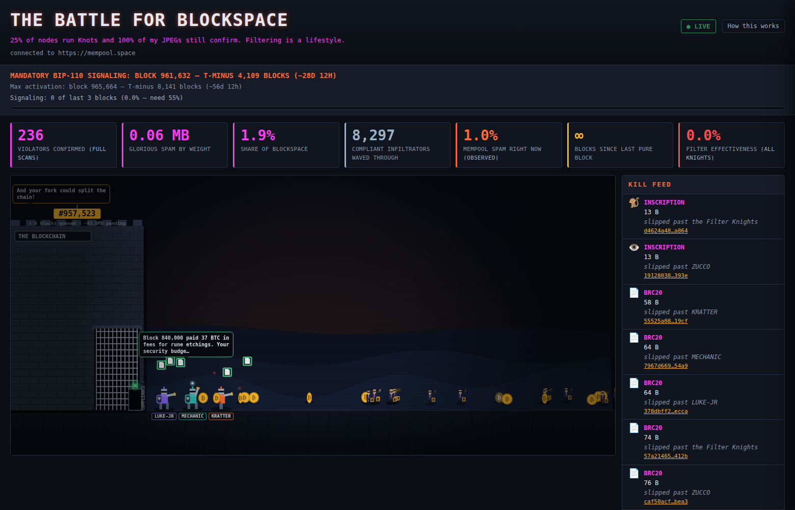

# THE BATTLE FOR BLOCKSPACE

A satirical, fully client-side live visualization of the Bitcoin "spam war."
Real mempool transactions charge a castle gate — **THE BLOCKCHAIN** — defended
by the Filter Knights (Luke-jr, Bitcoin Mechanic, Matthew Kratter). Their
filter shots bounce off. Blocks confirm. The spam gets in anyway. A scoreboard
keeps the receipts, and every single sprite is a real transaction you can click
through to mempool.space.



## The joke

The defenders are noble, earnest, and completely ineffective. **Policy is not
consensus.** Bitcoin Knots can filter your transaction; the next pool mines it.
BIP-110 can schedule a soft fork; the monkeys keep confirming without missing a
block. The site commits to the pro-spam bit in its copy while staying
technically accurate — and it discloses exactly how it works.

Three unit archetypes come out of one classifier:

- **VIOLATORS** — inscriptions, BRC-20, Stamps, big OP_RETURNs, large
  runestones — the charging JPEG horde (would violate BIP-110 if it were active).
- **INFILTRATORS** — data protocols that are *BIP-110-compliant* anyway, mostly
  small Runes — they stroll through the checkpoint legally, briefcase in hand,
  while the knights seethe. This gap ("spam" ≠ "noncompliant") is the best joke
  in the project.
- **CITIZENS** — clean payments (and ≤83-byte functional memos) — waved through.

## Honest-data methodology

Nothing here is fabricated; only the framing is a joke. The "How this works"
modal spells this out in the app, but in short:

- **Full-block scans for headline numbers.** On each new block the browser
  fetches the raw block and classifies *100% of its transactions* — no
  first-100 sampling bias. Violator counts, spam weight, and blockspace share
  come from these full scans.
- **Rules applied flat.** BIP-110 is real but **not active**. All seven rules
  are checked against every transaction and labeled "*would violate BIP-110 if
  active*." Grandfathering (pre-activation UTXOs) is **not** applied — there is
  no activation height yet.
- **"Observed" is sampled** and labeled as such (the live mempool percentage).
- **Faces are cosmetic** — protocol → faction pool → random face. The protocol,
  matched rule text, and txid are the real parts.
- **Knots node share is disputed** (~20–25% of reachable nodes, opponents call
  it Sybil-inflated).
- Data courtesy of **mempool.space**. No backend — your browser talks to the
  public API directly and politely (≤1 REST req/sec sustained, one WebSocket).

## Local dev

Zero build step. Serve the folder statically over HTTP (ES modules need a real
origin — opening `index.html` via `file://` will not work):

```sh
python3 -m http.server 8080
# then open http://localhost:8080
```

## Deploy

Static site on Vercel (project `bitcoin-spam-war`):

```sh
npx vercel deploy --prod
```

`vercel.json` sets `cleanUrls` and a 5-minute cache on `/js` and `/css`. It
deliberately adds **no** headers that would restrict outbound connections —
the site must be able to reach mempool.space and its mirrors.

## Credits

- Live data courtesy of **[mempool.space](https://mempool.space)** and its
  public mirrors (mempool.emzy.de, mempool.bitcoin.de).
- Inspired by **Bitcoin Battlefield** by Nick Greenawalt.
- BIP-110 — "Reduced Data Temporary Softfork" — is a real proposal by the
  pseudonymous *Dathon Ohm* (original draft credited to Luke-Jr). Read it:
  [bip-0110.mediawiki](https://github.com/bitcoin/bips/blob/master/bip-0110.mediawiki)
  · [bip110.org](https://bip110.org/).

## Roadmap / potential next steps

Nothing here is committed — ideas in rough priority order:

- **Fork-watch readiness** — the site's two natural traffic moments are
  block **961,632** (mandatory signaling begins, ~Aug 7 2026) and
  **965,664** (max activation, ~Sep 1). A "FORK WEEK" banner, a signaling
  live-ticker set-piece, and load-testing before those dates.
- **Analytics** — Vercel Web Analytics (cookieless, served first-party from
  `/_vercel/insights/script.js`): flip the project toggle + one script tag.
- **Custom domain** and posting the link places where Puritans can see it.
- **True inscription art** — resolve the actual inscription in a reveal tx
  (via an ord indexer API) and show *that* image on the unit instead of a
  cosmetic collection sample.
- **Per-knight stats** — kill attribution leaderboard (still 0 kills each).
- **Trench Chat upgrades** — NIP-07 extension sign-in for real Nostr
  identities, a client-side mute list, kind-41 channel metadata refresh
  (requires the channel creator key, held offline).
- **Historical replay mode** — "watch block 840,000" (the 37-BTC-fee Runes
  halving block) replayed through the battle engine.
- **Scale path** if it ever goes viral: Cloudflare Pages (free bandwidth)
  or Vercel Pro for hosting; a fan-out relay server or self-hosted
  mempool instance to take per-visitor load off mempool.space.

## License

MIT for the code (see [LICENSE](LICENSE)). Collection artwork under
`assets/pfps/` belongs to its creators — sources in
[assets/pfps/sources.json](assets/pfps/sources.json).

## Disclaimer

Parody of a public policy debate among public figures — playful, not
defamatory. All transactions shown are real. No filters were harmed. Not
affiliated with mempool.space. 100% BIP-110-noncompliant website.
